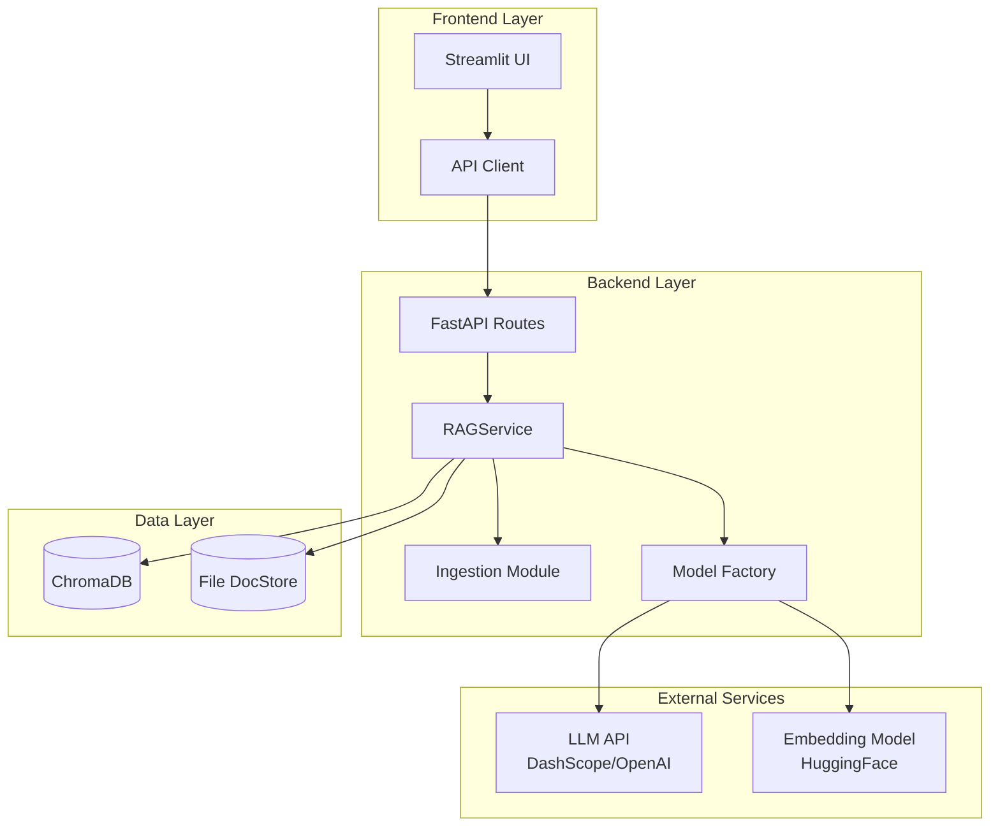
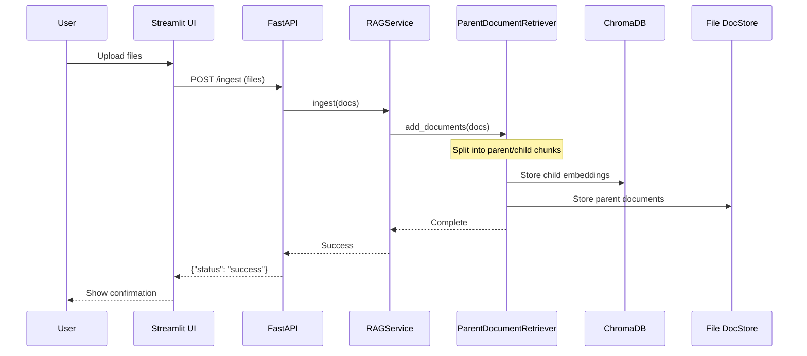
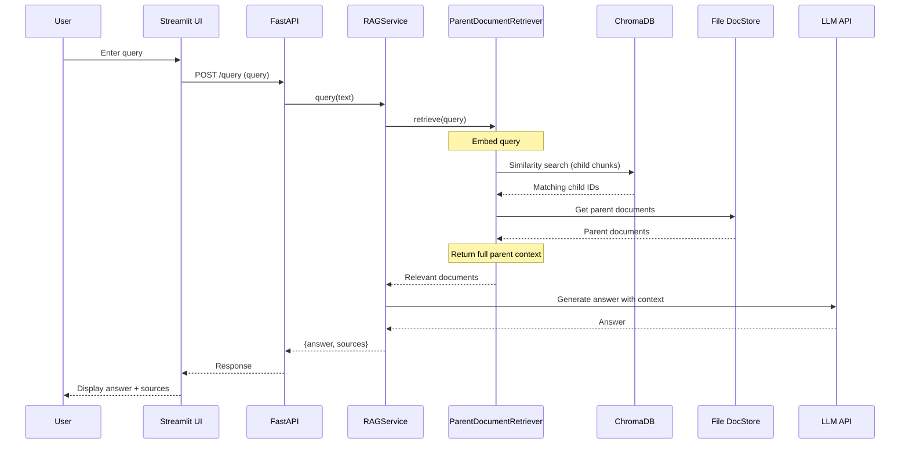
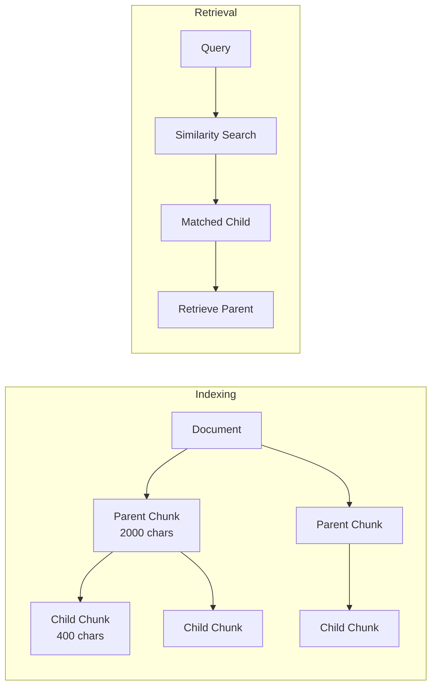

# RAGSimple Architecture

This document describes the system architecture and main data flow of RAGSimple.

---

## System Overview

RAGSimple is a Retrieval-Augmented Generation (RAG) application built with a modular architecture. It enables users to upload documents, index them using vector embeddings, and query against the indexed content using an LLM.

---

## Architecture Diagram



---

## Component Architecture

### 1. Frontend Layer

| Component | File | Description |
|-----------|------|-------------|
| **Streamlit UI** | `app/frontend/main.py` | Web-based user interface for document upload and querying |
| **API Client** | `app/frontend/api_client.py` | HTTP client for communicating with the backend API |

### 2. Backend Layer

| Component | File | Description |
|-----------|------|-------------|
| **FastAPI Routes** | `app/backend/api/routes.py` | REST API endpoints |
| **FastAPI App** | `app/backend/api/main.py` | FastAPI application configuration |
| **RAGService** | `app/backend/core/rag_service.py` | Core RAG orchestration service |
| **Ingestion** | `app/backend/core/ingestion.py` | Document processing and chunking |
| **Config** | `app/backend/core/config.py` | Configuration management |
| **Model Factory** | `app/backend/models/factory.py` | LLM and embedding model instantiation |

### 3. Data Layer

| Component | Type | Description |
|-----------|------|-------------|
| **ChromaDB** | Vector Database | Stores document embeddings for similarity search |
| **File DocStore** | Local File System | Stores parent document chunks for retrieval |

---

## Directory Structure

```
RAGSimple/
├── app/
│   ├── backend/
│   │   ├── api/           # REST API endpoints
│   │   │   ├── main.py    # FastAPI app
│   │   │   └── routes.py  # API routes
│   │   ├── core/          # Core business logic
│   │   │   ├── config.py      # Configuration
│   │   │   ├── ingestion.py   # Document processing
│   │   │   └── rag_service.py # RAG orchestration
│   │   └── models/
│   │       └── factory.py # Model creation
│   └── frontend/
│       ├── main.py        # Streamlit UI
│       └── api_client.py  # Backend client
├── configures/
│   └── config.toml        # Application configuration
├── data/
│   ├── DB/                # ChromaDB persistence
│   └── docstore/          # Parent document storage
├── docs/                  # Documentation
├── tests/                 # Test suite
└── main.py                # Entry point
```

---

## Main Data Flows

### Flow 1: Document Ingestion



**Process Details:**
1. User uploads documents via Streamlit UI
2. Frontend sends files to `/ingest` endpoint
3. Backend converts files to LangChain `Document` objects
4. `ParentDocumentRetriever` splits documents:
   - **Parent chunks:** 2000 chars with 200 overlap
   - **Child chunks:** 400 chars with 50 overlap
5. Child chunks are embedded and stored in ChromaDB
6. Parent chunks are stored in File DocStore
7. Returns success status to user

---

### Flow 2: Query Execution



**Process Details:**
1. User submits a question via Streamlit UI
2. Frontend sends query to `/query` endpoint
3. Query is embedded using the embedding model
4. ChromaDB performs similarity search on child chunks
5. Parent documents are retrieved from File DocStore
6. LLM generates answer using parent document context
7. Returns answer and source documents to user

---

## Parent-Child Retrieval Strategy

RAGSimple uses a **Parent-Child Retrieval** strategy for improved context quality:



**Benefits:**
- **Small chunks for search:** Better semantic matching
- **Large chunks for context:** More complete information for LLM
- **Reduced fragmentation:** Answers have full context

---

## Configuration

Configuration is managed via `configures/config.toml`:

```toml
[backend]
host = "0.0.0.0"
port = 8000
db_path = "data/DB"

[rag]
chunk_size = 1000
chunk_overlap = 200
semantic_threshold = 0.5

[models]
llm_type = "openai"
llm_model = "glm-5"
llm_base_url = "https://dashscope.aliyuncs.com/compatible-mode/v1"
embedding_type = "huggingface"
embedding_model = "BAAI/bge-small-zh-v1.5"
```

---

## Technology Stack

| Layer | Technology | Purpose |
|-------|------------|---------|
| **API Framework** | FastAPI | REST API backend |
| **UI Framework** | Streamlit | Web-based frontend |
| **RAG Framework** | LangChain | RAG pipeline orchestration |
| **Vector DB** | ChromaDB | Embedding storage and retrieval |
| **LLM** | DashScope/OpenAI-compatible | Answer generation |
| **Embeddings** | HuggingFace | Local embedding model |
| **Config** | TOML + Pydantic | Configuration management |

---

## Key Design Decisions

1. **Separation of Concerns:** Clear separation between API, core logic, and data layers
2. **Factory Pattern:** `ModelFactory` for flexible model instantiation
3. **Parent-Child Retrieval:** Optimized for both search accuracy and context completeness
4. **Local Embeddings:** HuggingFace models for offline embedding generation
5. **Configurable:** All parameters externalized to TOML configuration
